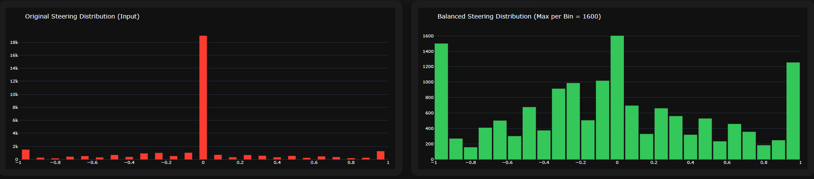
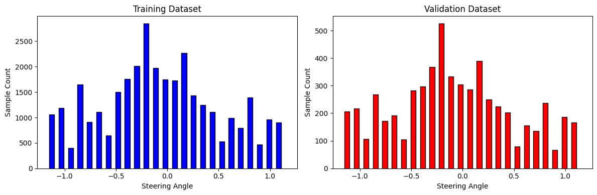

# CNN-Based Behavioral Cloning for Autonomous Driving

An end-to-end deep learning pipeline for autonomous steering angle prediction using the Udacity Self-Driving Car Simulator.

---

## Table of Contents
1. [Team Members](#team-members)  
2. [Project Overview](#project-overview)  
3. [Roadmap](#roadmap)  
4. [Data Collection](#data-collection)  
5. [Data Processing & Augmentation](#data-processing--augmentation)  
6. [Dataset & DataLoader](#dataset--dataloader)  
7. [Model Architecture](#model-architecture)  
8. [Training](#training)  
9. [Deployment & Real-Time Inference](#deployment--real-time-inference)  
10. [Installation](#installation)  
11. [Usage](#usage)  
12. [Results & Visualizations](#results--visualizations)  
13. [License](#license)  
14. [Acknowledgments](#acknowledgments)
15. [Flie Structure](#file-structure)

---

## Team Members
- Abdelrhman Salah Kamal Sayed  
- Ibrahiem Montaser Fathy Elsfary  
- Adel Tamer Adel Badran  
- Sarah Elsayed Ahmed Zahran  
- Hend Khalid Anwar Elkholy  
- Doha Mohamed Abd Almajeed Darwish  
- Hasnaa Mohamed El Dasoky  

---

## Project Overview

This repository implements a complete behavioral cloning pipeline that predicts continuous steering angles directly from front-facing RGB camera images. The system is trained on data collected from the Udacity Self-Driving Car Simulator and achieves real-time autonomous driving performance within the same environment.

**Key Features:**
- Multi-camera data utilization (center, left, right) with steering angle correction (±0.15)
- Steering distribution balancing via histogram-based undersampling (25 bins, 1600 samples per bin)
- NVIDIA PilotNet-inspired preprocessing pipeline (crop → YUV conversion → blur → resize to 66×200)
- Comprehensive data augmentation including random flip, pan, affine scaling, and brightness adjustment
- Real-time inference server with dynamic throttle control and steering smoothing

---

## Roadmap

| Phase                           | Status       |
|---------------------------------|--------------|
| Data acquisition & preparation  | ✅ Completed |
| Preprocessing & augmentation    | ✅ Completed |
| Dataset & DataLoader            | ✅ Completed |
| NVIDIA Model implementation     | ✅ Completed |
| Training & validation pipeline  | ✅ Completed |
| Deployment (simulator control)  | ✅ Completed |

---

## Data Collection

**Primary Source:** Udacity Self-Driving Car Simulator (recording mode)  
**Dataset Used:** Kaggle – [zaynena/selfdriving-car-simulator](https://www.kaggle.com/datasets/zaynena/selfdriving-car-simulator)

**Dataset Structure:**
- `track1data/` – 31,845 samples (Track 1 only)
- `track2data/` – 65,484 samples (Track 2 only)
- `dataset/` – 97,329 samples (both tracks combined) ← **Used in this project**

**Data Format (`driving_log.csv`):**

Each row contains seven columns: `Center`, `Left`, `Right`, `Steering`, `Throttle`, `Brake`, `Speed`. The three camera images are synchronized at each timestep, and side cameras are augmented with ±0.15 steering correction to simulate recovery behavior from lane edges.

**Steering Distribution:**

The original dataset exhibits significant bias toward near-zero steering angles. To address this imbalance, histogram-based undersampling is applied across 25 bins, limiting each bin to 1600 samples. Negative steering values indicate right turns, while positive values represent left turns.

---

## Data Processing & Augmentation

### Preprocessing Pipeline (Applied to All Images)

```python
1. Crop: y=60:135, x=0:320 (remove sky and vehicle hood)
2. Convert: RGB → YUV color space
3. Blur: Gaussian blur (3×3 kernel)
4. Resize: 200×66 (width × height) using INTER_AREA interpolation
5. Normalize: [0, 255] → [0, 1]
6. Transform: HWC → CHW tensor format
```

### Training-Time Augmentations

- **Random Horizontal Flip** (50% probability): Mirrors image and inverts steering angle
- **Random Horizontal Pan** (±10% range): Simulates lateral position variation with corresponding steering adjustment
- **Affine Scaling** (1.0–1.4×, 50% probability): Varies apparent distance to simulate depth changes
- **Brightness Adjustment** (-0.8 to +0.2, 50% probability): Simulates varying lighting conditions

All augmentations are implemented using **Albumentations** for efficient GPU-accelerated performance.

---

## Dataset & DataLoader

- Custom PyTorch `DrivingDataset` class with integrated augmentation support
- Multi-camera expansion: 3× data multiplication (center, left, right cameras)
- Train/validation split: 80/20 with fixed random seed (`random_state=42`)
- **Batch size:** 64
- **DataLoader workers:** 4 with pinned memory for optimized GPU transfer

**Final Dataset Sizes:**
- Training: ~77,863 samples (after balancing and camera expansion)
- Validation: ~19466 samples

---

## Model Architecture

### NVIDIA PilotNet (CNN)

The system implements an end-to-end learning approach using a Convolutional Neural Network to map raw pixel data from a single front-facing camera directly to steering commands, optimizing all processing steps simultaneously. This architecture is based on NVIDIA's proven 2016 design for autonomous driving.

**Network Structure:**

The network consists of 9 layers: one normalization layer (flatten), five convolutional layers, and three fully connected layers. Input images are converted to YUV color space before being fed into the network.

### Vision Transformer (ViT)

This project also explores a Vision Transformer approach for end-to-end steering angle regression, extending beyond traditional CNN-based methods.

- **Backbone:** `vit_tiny_patch16_224` (via timm), pretrained on ImageNet, selected for optimal balance between computational efficiency and feature extraction
- **Custom Head:** Classification head replaced with a regression MLP comprising linear layers, GELU activations for smoother gradients, and dropout (0.1) for regularization
- **Global Pooling:** Global Average Pooling (GAP) condenses spatial patch tokens into a comprehensive global context vector

**Training Strategy (Two-Stage Fine-Tuning):**

To prevent catastrophic forgetting of pretrained weights, a two-stage optimization strategy is employed:

1. **Warm-up / Linear Probing (Epochs 0-3):** Backbone frozen; only the regression head is trained with learning rate 1e-4 to adapt to the driving domain
2. **Full Fine-Tuning (Epoch 4+):** Entire network unfrozen with learning rate decayed to 1e-5 (weight decay 1e-6) to refine feature representations while preserving prior knowledge

---

## Training

The training process utilizes Mean Squared Error (MSE) loss for steering angle regression with the Adam optimizer. Model checkpoints are saved at regular intervals, and the best-performing model based on validation loss is preserved for deployment.

---

## Deployment & Real-Time Inference

### 🚗 Enhanced Smart Drive System (`auto_mode.py`)

A compact, high-performance autonomous driving engine using **Adaptive Response Control** for smooth, stable, and intelligent real-time driving.

#### 🔥 Core Features
- **Curve Severity Classification** (STRAIGHT → EXTREME)
- **Dynamic Steering Boost** (1.0× → 2.7×)
- **Adaptive Smoothing** per curve category
- **Multi-Profile Throttle Control**  
  - Braking (negative throttle)  
  - Reverse throttle in EXTREME recovery  
  - Safe acceleration + speed targeting  
- **Speed Bands** for stability *(3 → 23 km/h)*
- **Camera Correction** for left/right feeds
- **Real-Time Image Recorder**
- **Professional Console Telemetry**

#### 🌀 Curve Categories
| Category | Boost | Response | Speed |
|---------|--------|-----------|--------|
| 🔴 EXTREME | 1.5–2.7× | 95% | 3–7 km/h |
| 🟠 VERY_SHARP | 1.4–1.9× | 90% | 5–10 km/h |
| 🟡 SHARP | 1.3–1.7× | 85% | 7–13 km/h |
| 🟢 MEDIUM | 1.2–1.5× | 70% | 9–17 km/h |
| 🔵 GENTLE | 1.1–1.3× | 55% | 15–20 km/h |
| ⚪ STRAIGHT | 1.0× | 40% | 18–23 km/h |

#### ⚙️ Adaptive Throttle
- Negative throttle for braking  
- Reverse pulses for EXTREME recovery  
- Category-based acceleration  
- Throttle smoothing **0.35 → 0.85**

### Real-Time Self-Driving Visualization System

A fully integrated autonomous driving loop using Socket.IO enables comprehensive system monitoring:

The simulator streams live telemetry (camera and sensor data) via Socket.IO to a Python inference server running the PilotNet model, which returns steering and throttle commands instantaneously. All data is simultaneously broadcast through Socket.IO to a rich web dashboard displaying live camera feed, 3D animated steering wheel visualization, and real-time Plotly charts including steering angle timeline, speed and acceleration plots, steering distribution histogram, speed vs. angle heatmap, key events chart with detailed event list, and an overview chart combining speed and steering angle.

A separate FastAPI endpoint with a neon-themed UI provides instant steering prediction from uploaded images. All components are synchronized in real-time for comprehensive system monitoring.

### Command-Line Arguments

```bash
python auto_mode.py model.pth [image_folder] [options]

Options:
  --camera {center,left,right}  Camera stream selection (default: center)
  --steer_correction FLOAT      Left/right camera correction (default: 0.2)
  --alpha FLOAT                 Steering smoothing factor (default: 0.2)
  --max_limit FLOAT             Maximum speed on straight sections in km/h (default: 15.0)
  --max_throttle FLOAT          Maximum throttle value 0-1 (default: 0.8)
  --port INT                    Server port (default: 4567)
```

---

## Installation

### 1. Clone Repository

```bash
git clone https://github.com/your-username/self-driving-car-bc.git
cd self-driving-car-bc
```

### 2. Create Virtual Environment (Recommended)

```bash
python -m venv venv
source venv/bin/activate    # Linux/Mac
venv\Scripts\activate       # Windows
```

### 3. Install Dependencies

```bash
pip install --upgrade pip
pip install -r requirements.txt
```

### 4. Download Udacity Simulator

- [Linux](https://d17h27t6h515a5.cloudfront.net/topher/2017/February/58ae46bb_linux-sim/linux-sim.zip)
- [macOS](https://d17h27t6h515a5.cloudfront.net/topher/2017/February/58ae4594_mac-sim.app/mac-sim.app.zip)
- [Windows](https://d17h27t6h515a5.cloudfront.net/topher/2017/February/58ae4419_windows-sim/windows-sim.zip)

---

## Usage

### Running Autonomous Mode

```bash
# Basic usage with center camera
python drive.py nvidia_model.pth

# Advanced usage with custom settings
python drive.py best_model.pth run_images/ \
  --camera center \
  --max_limit 20.0 \
  --max_throttle 0.9 \
  --alpha 0.3
```

### Simulator Connection

1. Launch the Udacity simulator
2. Select the desired track
3. Click **"Autonomous Mode"**
4. The simulator automatically connects to `localhost:4567`

### Expected Console Output

```
📦 Loading model from: nvidia_model.pth
✓ Model loaded and set to eval
📸 Saving images to: output_images
🌐 Starting server on port 4567 ...
🎯 Enhanced angle boost in curves
🐢 Lower speeds for safety
⚡ Max throttle: 0.65
```

---

## Results & Visualizations

### Performance Metrics

The model successfully completes full autonomous laps on Track 2 with smooth cornering, dynamic speed adjustment based on curve severity, and stable recovery from lane deviations using side camera training data.

### Key Visualizations

### Visualizations

#### Steering Distribution Balancing


#### Train Vs Validation


#### Training Augmentation Examples


---

## Troubleshooting

### Model Won't Load

Ensure you are using the correct checkpoint format. If issues persist, try:

```python
torch.load(model_path, map_location='cpu')
```

### Simulator Won't Connect

- Verify firewall settings allow connections on port 4567
- Ensure the simulator is in Autonomous Mode
- Confirm no other process is using port 4567

### Car Drives Off Track

- Reduce `--max_limit` (try 10-12 km/h)
- Increase steering smoothing with `--alpha` (try 0.3-0.4)
- Consider retraining with additional data or improved distribution balancing

### Jerky Steering

- Increase `--alpha` for more aggressive smoothing
- Verify the model was trained with sufficient augmentation

---

## License

This project is licensed under the **MIT License**

---

## Acknowledgments

- **Udacity** for the Self-Driving Car Simulator and curriculum inspiration
- **NVIDIA** for pioneering end-to-end learning research: [End-to-End Deep Learning for Self-Driving Cars](https://images.nvidia.com/content/tegra/automotive/images/2016/solutions/pdf/end-to-end-dl-using-px.pdf)
- **Kaggle dataset provider:** [zaynena](https://www.kaggle.com/zaynena)
- **PyTorch** and **Albumentations** communities for excellent tools and libraries

---

## File Structure

```

CNN-Based Behavioral Cloning for Autonomous Driving/
├── Deployment/                     # Deployment and inference components
│   ├── predictor/                  # Standalone prediction service
│   ├── sim_server/                 # Simulator communication server
│   └── sim_web/                    # Web-based visualization dashboard
├── Saved Models/                   # Trained model checkpoints
│   │── vit_model.pth               # Vision Transformer weights
│   └── nvidia_model.pth            # NVIDIA PilotNet weights
├── Installation/                   # Setup and configuration files
│   ├── requirements.txt            # Python dependencies
│   └── setup_instructions.md       # Detailed installation guide
├── Notebooks/                      # Training notebooks
│   └── Self_Driving_Car_Sim.ipynb  # NVIDIA PilotNet & VIT training
└── README.md                       # Project documentation

```

---


**Happy autonomous driving!** 🚗💨